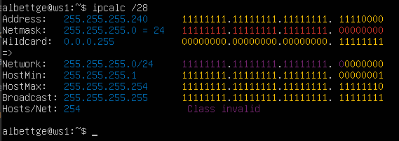
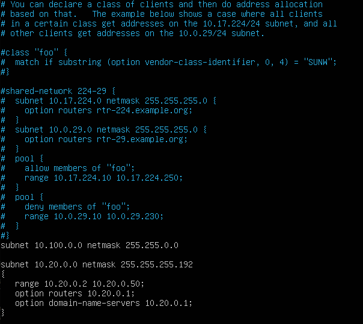
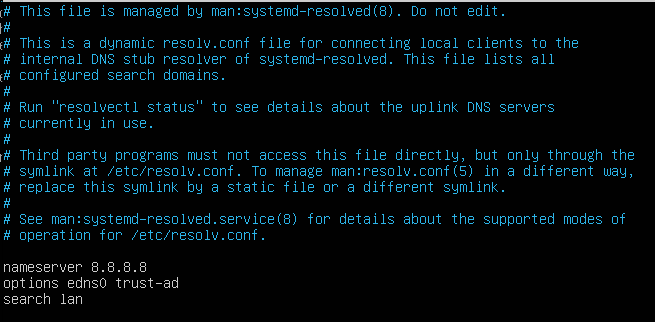

# Linux_02

## Part 1. Инструмент **ipcalc**
## 1.1. Сети и маски
- ``1`` 

- ``sudo apt install ipcalc`` 
- ``смотрим адрес сети 192.167.38.54/13 `` 
- ``адрес сети - Network: `` 
 
- ``2`` 
- ``перевод маски 255.255.255.0 в префиксную и двоичную запись - netmask:`` 
 
- ``перевод маски /15 в обычную и двоичную `` 
 
- ``11111111.11111111.11111111.11110000 в обычную и префиксную `` 
 

- ``3`` 
- ``Минимальный и максимальный хост в сети 12.167.38.4`` 
- ``HostMin и HostMax`` 
- ``При маске /8`` 
 

- ``При маске 11111111.11111111.00000000.00000000`` 
 

- ``При маске 255.255.254.0`` 
 

- ``При маске /4`` 
 

## 1.2. localhost

- ``Определяем можно ли обратиться к приложению, работающему на localhost`` 
- ``IP: 194.34.23.100 - нельзя`` 
- ``IP: 127.0.0.2 - можно`` 
- ``IP: 127.1.0.1 - можно`` 
- ``IP: 128.0.0.1 - нельзя`` 
- ``Команда для проверки - ping <IP-adress> `` 

## 1.3. Диапазоны и сегменты сетей

- ``1) какие из перечисленных IP можно использовать в качестве публичного, а какие только в качестве частных: 10.0.0.45, 134.43.0.2, 192.168.4.2, 172.20.250.4, 172.0.2.1, 192.172.0.1, 172.68.0.2, 172.16.255.255, 10.10.10.10, 192.169.168.1`` 
- ``В качестве публичного: 134.43.0.2, 172.0.2.1, 192.172.0.1, 172.68.0.2, 192.169.168.1. В качестве чаcтных: 10.0.0.45, 192.168.4.2, 172.20.250.4, 172.16.255.255, 10.10.10.10.`` 
- ``Для отличия используем команду ipcalc и смотрим на класс - если Private то частные, иначе публичные.`` 

- ``2) какие из перечисленных IP адресов шлюза возможны у сети 10.10.0.0/18: 10.0.0.1, 10.10.0.2, 10.10.10.10, 10.10.100.1, 10.10.1.255`` 
- ``Возможны: 10.10.0.2, 10.10.10.10, 10.10.1.255 Невозможны: 10.0.0.1, 10.10.100.1.`` 
- ``Используем команду ipcalc и смотрим на значение Network`` 

---

## Part 2. Статическая маршрутизация между двумя машинами

- ``С помощью команды ip a смотрим существующие сетевые интерфейсы`` 
- ``Первая виртуальная машина``                                                                                                                                                     
 
- ``Вторая виртуальная машина`` 
 

- ``Описать сетевой интерфейс, соответствующий внутренней сети, на обеих машинах и задать следующие адреса и маски: ws1 - 192.168.100.10, маска /16, ws2 - 172.24.116.8, маска /12`` 
- ``Скрины с содержанием изменённого файла etc/netplan/00-installer-config.yaml для каждой машины.`` 
- ``Первая виртуальная машина``                                                                                                                                                     
 
- ``Вторая виртуальная машина`` 
 

## 2.1. Добавление статического маршрута вручную

- ``Добавляем статический маршрут от одной машины до другой и обратно при помощи команды вида ip r add, и пингуем соединение между машинами``   
- ``Для сохранения изменений в файле etc/netplan/00-installer-config.yaml выполняем команду sudo netplan apply``       
- ``Первая виртуальная машина``                                                                                                                                                     
 
- ``Вторая виртуальная машина`` 
 

## 2.2. localhost

- ``Добавляем статический маршрут от одной машины до другой с помощью файла etc/netplan/00-installer-config.yaml``  
- ``Первая виртуальная машина``  
 
- ``Вторая виртуальная машина`` 
 

- ``Пингуем соединение между машинами`` 
- ``Первая виртуальная машина``  
 
- ``Вторая виртуальная машина`` 
 

---

## Part 3. Утилита **iperf3**

## 3.1. Скорость соединения

- ``Перевод:`` 
- ``8 Mbps = 1 MB/s; `` 
- ``100 MB/s = 819200 Kbps;``  
- ``1 Gbps = 1024 Mbps`` 

## 3.2. Утилита iperf3

- ``После введенных изменений в файл .yaml скачиваем iperf3 командой: sudo apt install iperf3`` 
- ``ws1 выступает в роли сервера. Запускаем iperf3 сервер, командой: iperf3 -s -f m`` 
 
- ``ws2 выступает в роли клиента. Запускаем iperf3 клиент, командой: iperf3 -c 192.168.100.10`` 
 

---

## Part 4. Сетевой экран

## 4.1. Утилита iptables

- ``Создаем файл /etc/firewall.sh, имитирующий фаерволл, на ws1 и ws2: командой sudo touch /etc/firewall.sh`` 
- `` Командой sudo chmod +w /etc/firewall.sh предоставляем права доступа на запись в файл, и в Nano меняем содержимое файла`` 
- `` Добавляем в файл подряд следующие правила:`` 
- ``1) на ws1 применить стратегию когда в начале пишется запрещающее правило, а в конце пишется разрешающее правило (это касается пунктов 4 и 5)`` 
- ``2) на ws2 применить стратегию когда в начале пишется разрешающее правило, а в конце пишется запрещающее правило (это касается пунктов 4 и 5) `` 
- ``3) открыть на машинах доступ для порта 22 (ssh) и порта 80 (http)`` 
- ``4) запретить echo reply (машина не должна "пинговаться”, т.е. должна быть блокировка на OUTPUT)`` 
- ``5) разрешить echo reply (машина должна "пинговаться")`` 

- ``Первая виртуальная машина``  
 
- ``Вторая виртуальная машина`` 
 

- ``Разница между стратегиями в том, какое правило выполняется. Так как учитывается только первое встречаемое пакетом подходящее правило, то на первой машине это запрет (REJECT), а на второй - разрешение (ACCEPT).``  

- ``Запускаем файлы на обеих машинах командами sudo chmod +x /etc/firewall.sh и sudo /etc/firewall.sh``  
- ``Первая виртуальная машина``  
 
- ``Вторая виртуальная машина`` 
 

## 4.2. Утилита nmap

- ``Командой ping находим машину, которая не "пингуется", после чего утилитой nmap показываем, что хост машины запущен`` 
- ``Первая виртуальная машина - пингуется``  
 
- ``Вторая виртуальная машина - не пингуется`` 
 
- ``Запускаем утилиту nmap, предварительно скачав ее, и выполнив необходимые конфигурации в файле .yaml``  
- ``В выводе видим host is up - значит что хост запущен но не пингуется`` 
 

---

## Part 5. Статическая маршрутизация сети

## 5.1. Настройка адресов машин

- ``Настраиваем конфигурации машин в etc/netplan/00-installer-config.yaml согласно сети на рисунке.`` 
- ``ws11``  
 
- ``r1``  
 
- ``r2``  
 
- ``ws22``  
 
- ``ws21``  
 

- ``Перезапускаем сервис сети. Если ошибок нет, то командой ip -4 a проверяем, что адрес машины задан верно. Также пингуем ws22 с ws21. Аналогично пингуем r1 с ws11.``  
- ``ws11``  
- ``ip -4 a и пинг с r1``  
 
- ``r1``  
 
- ``r2``  
 
- ``ws22``  
 
- ``ws21``  
- ``ip -4 a и пинг с ws22``  
 

## 5.2. Включение переадресации IP-адресов.

- ``Для включения переадресации IP, выполняем команду на роутерах: sysctl -w net.ipv4.ip_forward=1`` 
- ``При таком подходе переадресация не будет работать после перезагрузки системы.``  
- ``r1``  
 
- ``r2``  
 

- ``Открываем файл /etc/sysctl.conf и добавляем в него следующую строку: net.ipv4.ip_forward = 1`` 
- ``При использовании этого подхода, IP-переадресация включена на постоянной основе.`` 
- ``r1``  
 
- ``r2``  
 

## 5.3. Установка маршрута по-умолчанию

##### ``Настраиваем маршрут по-умолчанию (шлюз) для рабочих станций. Для этого добавляем default перед IP роутера в файле конфигураций и gateway4 [ip роутера]``  
- ``ws11``  
 
- ``ws22``  
 
- ``ws21``  
 
- ``r1``  
 
- ``r2``  
 

##### Вызываем `ip r` и показываем, что добавился маршрут в таблицу маршрутизации
- ``ws11``  
 
- ``ws22``  
 
- ``ws21``  
 
- ``r1``  
 
- ``r2``  
 

##### Пингуем с ws11 роутер r2 и показываем на r2, что пинг доходит. Для этого используем команду:
`tcpdump -tn -i enp0s9`

- ``ws11``  
 
- ``r2``  
 

#### 5.4. Добавление статических маршрутов
##### Добавляем в роутеры r1 и r2 статические маршруты в файле конфигураций.
- ``r1``  
 
- ``r2``  
 
##### Вызываем `ip r` и показываем таблицы с маршрутами на обоих роутерах.
- ``r1``  
 
- ``r2``  
 
##### Запускаем команды на ws11:
- ``ip r list 10.10.0.0/[маска сети]` и `ip r list 0.0.0.0/0``  
 
Для адреса 10.10.0.0/18 был выбран маршрут, отличный от 0.0.0.0/0, потому что  маршрут по умолчанию имеет более низкий приоритет, а для сети 10.10.0.0 мы создали правило, соответственно используется созданный маршрут.

#### 5.5. Построение списка маршрутизаторов

##### Запускаем на r1 команду дампа:
`tcpdump -tnv -i enp0s9`
- ``Сам вызов и вывод команды:``  
 
 

##### При помощи утилиты **traceroute** построить список маршрутизаторов на пути от ws11 до ws21
- ``Сперва скачиваем утилиту traceroute: sudo apt install trace route, для этого временно изменяем файл конфигураций, для доступа к внешней сети интернет``  
 

Traceroute (или трассировка маршрута) - это утилита командной строки, доступная в большинстве операционных системах, включая Linux. Она используется для определения маршрута, который сетевой пакет пройдет от исходного узла до конечного пункта (хоста). Таким образом, traceroute помогает выявить промежуточные узлы (маршрутизаторы), через которые проходит пакет, а также определить время, затраченное на прохождение каждого узла.

Принцип работы traceroute на Linux:

Определение TTL (Time to Live): Когда пакет отправляется через сеть, устанавливается значение TTL, которое представляет собой количество промежуточных узлов (маршрутизаторов), которые пакет может проходить, прежде чем будет удален из сети. Исходно TTL устанавливается на 1.

Отправка пакетов с увеличивающимся TTL: Traceroute отправляет серию пакетов с постепенно увеличивающимся значением TTL. Например, первый пакет отправляется с TTL=1, следующий с TTL=2 и так далее. Это позволяет определить промежуточные узлы, исходя из того, где пакеты прекращают своё движение.

Получение ответов от узлов: Каждый промежуточный узел, через который проходят пакеты, уменьшает значение TTL на 1. Когда значение TTL достигает нуля, узел, через который прошел пакет, удаляет его из сети и отправляет обратно уведомление (ICMP-сообщение) об этом отправителю traceroute.

Отображение информации: Traceroute выводит информацию о каждом промежуточном узле, такую как IP-адрес, имя хоста (если доступно) и время, затраченное на прохождение пакета до узла. Таким образом, traceroute строит маршрут от исходного узла до конечного пункта.

Примечание:

Если пакет доходит до конечного пункта, то он также может получить ответ от этого пункта, что также будет отображено в выводе traceroute.
В случае, если узел на пути отключен для передачи ICMP-сообщений (например, из-за настроек безопасности или брандмауэра), traceroute может показать символ "*" для этого узла.

#### 5.6. Использование протокола **ICMP** при маршрутизации

##### Запускаем на r1 перехват сетевого трафика, проходящего через enp0s8 с помощью команды:
`tcpdump -n -i enp0s8 icmp`
 

##### Пингуем с ws11 несуществующий IP (например, *10.30.0.111*) с помощью команды:
`ping -c 1 10.30.0.111`

 

---

## Part 6. Динамическая настройка IP с помощью **DHCP**

##### Для r2 настраиваем в файле */etc/dhcp/dhcpd.conf* конфигурацию службы **DHCP**:
##### 1) указываем адрес маршрутизатора по-умолчанию, DNS-сервер и адрес внутренней сети.:
 
##### 2) в файле *resolv.conf* прописываем `nameserver 8.8.8.8.`
 
##### 1 - Перезагружаем службу **DHCP** командой `systemctl restart isc-dhcp-server`. 2 - Машину ws21 перезагружаем при помощи `reboot` и через `ip a` показываем, что она получила адрес. 3 - Также пингуем ws22 с ws21.
- ``1``  
 
- ``2``  
- ``/reboot``  
- ``/ip a``  
 
- ``3``  
 

##### Указать MAC адрес у ws11, для этого в *etc/netplan/00-installer-config.yaml* надо добавить строки: `macaddress: 10:10:10:10:10:BA`, `dhcp4: true`
- ``ws11``  
 

##### Для r1 настроить аналогично r2, но сделать выдачу адресов с жесткой привязкой к MAC-адресу (ws11). Провести аналогичные тесты
##### 1) указываем адрес маршрутизатора, DNS-сервер и адрес внутренней сети.:
 
##### 2) в файле *resolv.conf* прописываем `nameserver 8.8.8.8.`
 
##### 3) Перезагружаем службу **DHCP** командой `systemctl restart isc-dhcp-server`
 

##### Запашиваем с ws21 обновление ip адреса
- ``ip a до обновления``  
 
- ``ip a после обновления командами: sudo dhclient enp0s8 -r, и затем sudo dhclient enp0s8``  
 
- ``Использовал опцию -r, чтобы очистить список ip адресов``  

---

## Part 7. **NAT**

##### В файле */etc/apache2/ports.conf* на ws22 и r1 изменить строку `Listen 80` на `Listen 0.0.0.0:80`, то есть сделать сервер Apache2 общедоступным
 
 

##### Запустить веб-сервер Apache командой `service apache2 start` на ws22 и r1
 
 

##### Добавить в фаервол, созданный по аналогии с фаерволом из Части 4, на r2 следующие правила:
##### 1) удаление правил в таблице filter - `iptables -F`
##### 2) удаление правил в таблице "NAT" - `iptables -F -t nat`
##### 3) отбрасывать все маршрутизируемые пакеты - `iptables --policy FORWARD DROP`
 
##### Запускать файл также, как в Части 4
 
##### Проверить соединение между ws22 и r1 командой `ping`
 
 
##### Добавляем в файл ещё одно правило:
##### 4) разрешаем маршрутизацию всех пакетов протокола **ICMP**
 
##### Запускаем файл также, как в Части 4
 
##### Проверяем соединение между ws22 и r1 командой `ping`
 
 
##### Добавляем в файл ещё два правила:
##### 5) включаем **SNAT**, а именно маскирование всех локальных ip из локальной сети, находящейся за r2 (по обозначениям из Части 5 - сеть 10.20.0.0)
##### 6) включить **DNAT** на 8080 порт машины r2 и добавить к веб-серверу Apache, запущенному на ws22, доступ извне сети
 
##### Запускать файл также, как в Части 4
 

##### Проверить соединение по TCP для **SNAT**, для этого с ws22 подключиться к серверу Apache на r1 командой:
`telnet [адрес] [порт]`
- ``ws22`` 
 
- ``r1`` 
 

---
